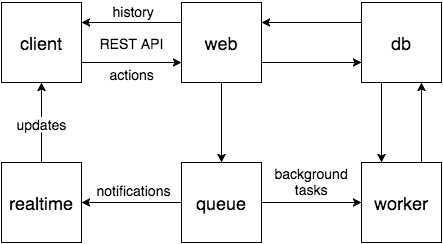

# Messenger



The [client](web/client/client) is a single-page app built with React, Redux,
ES6+, and webpack.

The backend is managed with Docker Compose. Containers:

| name                 | description                         | technology            |
|:-------------------- |:----------------------------------- |:--------------------- |
| [nginx](nginx)       | front-end proxy, static file server | Nginx                 |
| [web](web)           | API server                          | Django REST framework |
| [realtime](realtime) | notification server                 | Node.js, Primus       |
| queue                | message broker                      | RabbitMQ              |
| worker               | queue worker                        | Celery                |
| db                   | database                            | PostgreSQL            |

## Running

1. Create a Docker machine
   ```sh
   docker-machine create messenger.local --driver virtualbox
   eval $(docker-machine env messenger.local)
   ```

2. Set up Docker Composer
   ```sh
   export COMPOSE_FILE=docker-compose/development.yml
   export COMPOSE_PROJECT_NAME=messenger
   ```

3. Build and start containers
   ```sh
   make deploy
   ```
